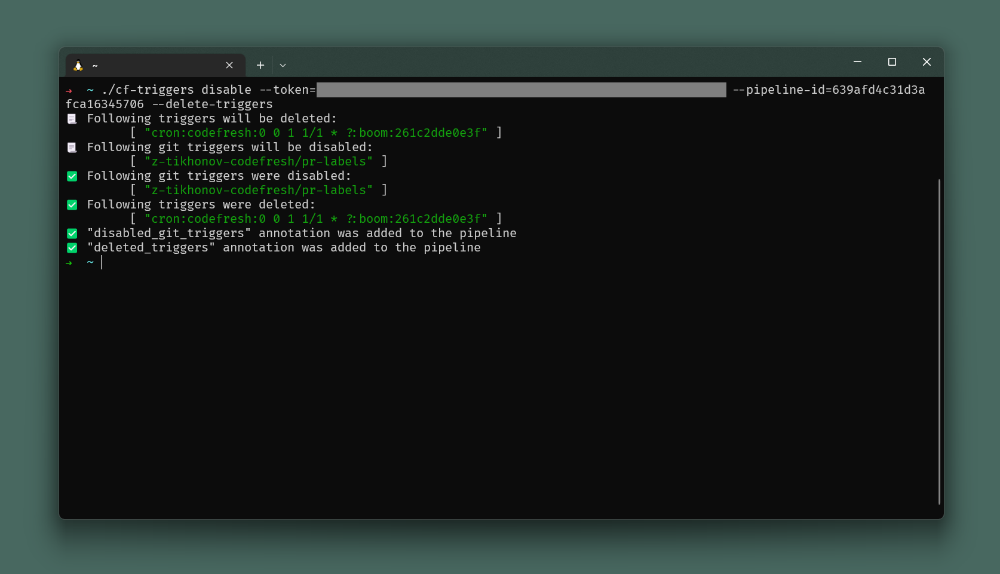
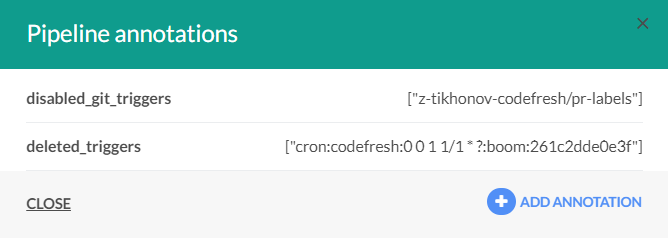
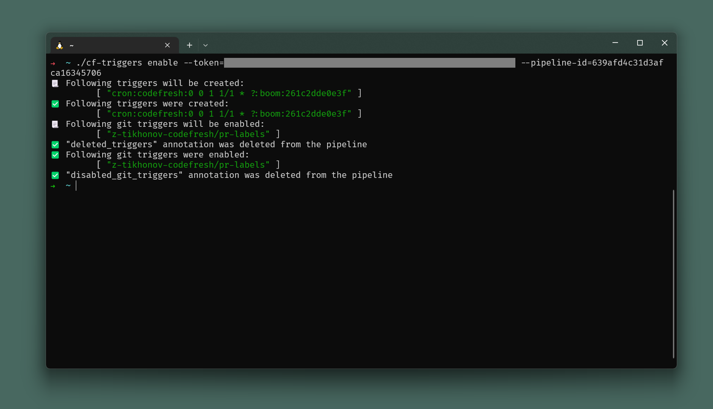

# Disable triggers

Small CLI which allows you to disable all pipeline triggers at once — with the ability to reenable it back!

## Installation

Please dowload latest binary from [Releases section](https://github.com/z-tikhonov-codefresh/cf-triggers/releases/latest).

## Usage

### `cf-triggers disable`

```Shell
$ cf-triggers disable --token=<your-codefresh-token> --pipeline-id=<target-pipeline-id> --delete-triggers
```

It disables git triggers (with optional removal of non-git ones) and stores all disabled/removed triggers in pipeline annotations `disabled_git_triggers` and `deleted_triggers`.

#### Flags

* `--token` [ required ] — your codefresh token.
* `--pipeline-id` [ required ] — ID of target pipeline.
* `--delete-triggers` [ optional ] — if set, non-git triggers will be removed. It's impossible to _disable_ non-git triggers, so the only way is to delete them.
* `--host` [ optional, defaults to `https://g.codefresh.io` ] — if set, will be used for API calls.

#### Examples




### `cf-triggers enable`

```Shell
$ cf-triggers enable --token=<your-codefresh-token> --pipeline-id=<target-pipeline-id>
```

It enables git triggers and recreates non-git triggers in accordance with `disabled_git_triggers` and `deleted_triggers` annotations of target pipeline.

Once it's done, it removes the above annotations.

#### Flags

* `--token` [ required ] — your codefresh token.
* `--pipeline-id` [ required ] — ID of target pipeline.
* `--host` [ optional, defaults to `https://g.codefresh.io` ] — if set, will be used for API calls.

#### Examples


